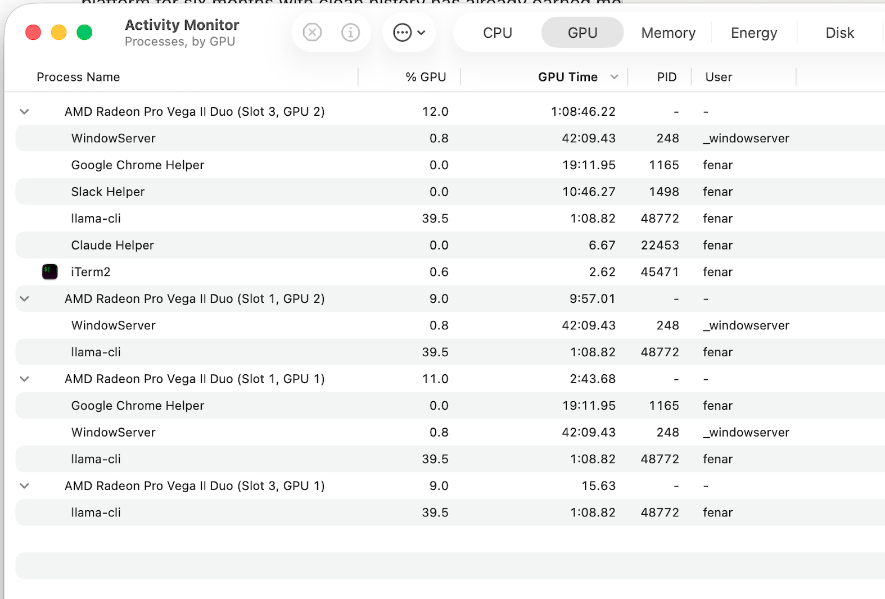
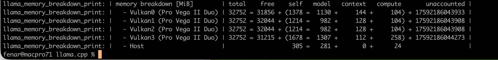

# GPU-Accelerated LLM Inference on Mac Pro 7,1 (Intel + AMD Vega II)

Running local AI inference on the 2019 Mac Pro using its AMD Radeon Pro Vega II Duo GPUs — a setup guide born from real-world trial and error.

## The Problem

The Mac Pro 7,1 ships with powerful AMD GPUs (up to 2x Vega II Duo = 4 GPU dies, 64 GB HBM2 total) that sit completely idle for AI workloads. The typical tools don't work out of the box:

| Approach | Status | Why |
|---|---|---|
| **Ollama** (default) | CPU only | Falls back to CPU on Intel Macs with AMD GPUs |
| **Metal backend** | Broken | `tensor API disabled for pre-M5 and pre-A19 devices` — Metal's ML ops require Apple Silicon |
| **MLX** | N/A | Apple Silicon only, no Intel support |
| **ROCm** | Linux only | Works if you dual-boot (Vega 20 = MI60 architecture, officially supported) |
| **Vulkan (MoltenVK)** | Works | Proper GPU compute via Vulkan shaders, translated to Metal by MoltenVK |

## The Solution

Build [llama.cpp](https://github.com/ggerganov/llama.cpp) with the **Vulkan backend enabled and Metal disabled**. This routes GPU compute through Vulkan shaders → MoltenVK → AMD GPU hardware, bypassing Metal's broken tensor API for non-Apple-Silicon GPUs.

### GPU Inference in Action

**All 4 Vega II dies active during inference (Activity Monitor):**



**VRAM distribution across 4 Vulkan devices (llama.cpp memory breakdown):**



## Hardware Tested

| Component | Spec |
|---|---|
| Machine | Mac Pro 7,1 (2019) |
| CPU | 2.7 GHz 24-Core Intel Xeon W |
| GPU | 2x AMD Radeon Pro Vega II Duo (4 GPU dies, 32 GB HBM2 each card) |
| RAM | 256 GB 2400 MHz DDR4 ECC |
| OS | macOS Tahoe 26.3.1 |

## Quick Start

```bash
chmod +x setup-llminfra-macpro.sh
./setup-llminfra-macpro.sh
```

This single script handles everything: dependency installation, llama.cpp clone and build, model download, and launches interactive chat with GPU acceleration.

## Manual Setup

### 1. Install Dependencies

```bash
brew install cmake vulkan-headers vulkan-loader molten-vk shaderc
```

### 2. Clone and Build llama.cpp

```bash
git clone https://github.com/ggerganov/llama.cpp
cd llama.cpp

# CRITICAL: Vulkan ON, Metal OFF
cmake -B build -DGGML_VULKAN=ON -DGGML_METAL=OFF
cmake --build build --config Release -j $(sysctl -n hw.ncpu)
```

Why `-DGGML_METAL=OFF`? If both backends are compiled, Metal takes priority and produces garbage output on AMD GPUs because its tensor operations are disabled for non-Apple-Silicon hardware.

### 3. Run Inference

**Interactive chat (Qwen 3.5-35B-A3B — recommended):**
```bash
./build/bin/llama-cli \
    -hf bartowski/Qwen_Qwen3.5-35B-A3B-GGUF:Q4_K_M \
    -ngl 99 -c 4096 \
    --repeat-penalty 1.1
```

**OpenAI-compatible API server:**
```bash
./build/bin/llama-server \
    -hf bartowski/Qwen_Qwen3.5-35B-A3B-GGUF:Q4_K_M \
    -ngl 99 -c 4096 \
    --repeat-penalty 1.1 --no-mmproj \
    --host 0.0.0.0 --port 8080
```

Then call it from any app:
```bash
curl http://localhost:8080/v1/chat/completions \
    -H "Content-Type: application/json" \
    -d '{
        "model": "local",
        "messages": [{"role": "user", "content": "Hello!"}]
    }'
```

## Key Flags

| Flag | Purpose |
|---|---|
| `-ngl 99` | Offload all model layers to GPU (Vulkan handles distribution across dies) |
| `-c 4096` | Context window size (increase for longer conversations, costs more VRAM) |
| `--repeat-penalty 1.1` | Prevents repetition loops (recommended for Vulkan backend precision) |
| `--no-mmproj` | Skip multimodal projection download (server mode — saves bandwidth) |
| `-hf repo:quant` | Auto-download from HuggingFace with specified quantization |

**Note:** `--chat-template` is omitted intentionally — llama.cpp auto-detects the correct template from GGUF metadata, which works better across different model families (Llama, Qwen, etc.).

## Model Size Guide

With 32 GB HBM2 VRAM (per Vega II Duo card) + 256 GB system RAM:

| Model | Quant | Size | Fits in VRAM? | Expected Speed |
|---|---|---|---|---|
| **Qwen 3.5-35B-A3B (MoE)** | **Q4_K_M** | **~20 GB** | **Yes (full GPU)** | **~37.6 tok/s** |
| Llama 3.1 8B | Q4_K_M | ~4.9 GB | Yes (full GPU) | ~50 tok/s |
| Llama 3.1 8B | Q8_0 | ~8.5 GB | Yes (full GPU) | ~35 tok/s |
| Llama 3.1 70B | Q4_K_M | ~40 GB | Partial (GPU+RAM split) | ~8-12 tok/s |
| DeepSeek Coder V2 | Q4_K_M | ~8.9 GB | Yes (full GPU) | ~40 tok/s |

**Recommended model:** Qwen 3.5-35B-A3B is a Mixture-of-Experts model (256 experts, 8 active, ~3B active params per token). It delivers excellent quality at 37.6 tok/s while fitting entirely in VRAM across all 4 Vega II dies.

Larger models spill from VRAM into your 256 GB system RAM — slower but still functional.

## Verifying GPU Usage

Open **Activity Monitor → GPU tab** while inference is running. You should see `llama-cli` or `llama-server` showing GPU utilization across all Vega II dies:

```
AMD Radeon Pro Vega II Duo (Slot 3, GPU 2)  —  llama-cli  39.5%
AMD Radeon Pro Vega II Duo (Slot 1, GPU 2)  —  llama-cli  39.5%
AMD Radeon Pro Vega II Duo (Slot 1, GPU 1)  —  llama-cli  39.5%
AMD Radeon Pro Vega II Duo (Slot 3, GPU 1)  —  llama-cli  39.5%
```

If you see 0% GPU and high CPU usage, Metal may have taken over — rebuild with `-DGGML_METAL=OFF`.

## Troubleshooting

**"Could NOT find Vulkan (missing: glslc)"**
Install the shader compiler: `brew install shaderc`

**Garbage output (random characters)**
Metal backend is active instead of Vulkan. Rebuild with `-DGGML_METAL=OFF`.

**Model output is coherent but off-topic**
Don't use the `-p` flag with interactive chat mode — type your prompt at the `>` prompt instead.

**Model output repeats endlessly**
Add `--repeat-penalty 1.1` to your command. Vulkan backend floating-point precision on Vega II can cause sampling loops without this penalty.

**Server auto-downloads a large mmproj file**
Add `--no-mmproj` flag to skip the unnecessary multimodal projection download for text-only inference.

**Slow performance / CPU only**
Verify `libggml-vulkan.dylib` exists in your build directory. If missing, cmake didn't find Vulkan — check that `vulkan-loader` and `molten-vk` are installed.

## What About Linux + ROCm?

If you want maximum performance, the Vega II Duo is based on the **Vega 20 die — the same chip as the AMD Instinct MI60**, which is officially supported by ROCm. Dual-booting RHEL gives you access to PyTorch, vLLM, and text-generation-inference with full ROCm GPU acceleration. That's the nuclear option if Vulkan performance isn't sufficient.

