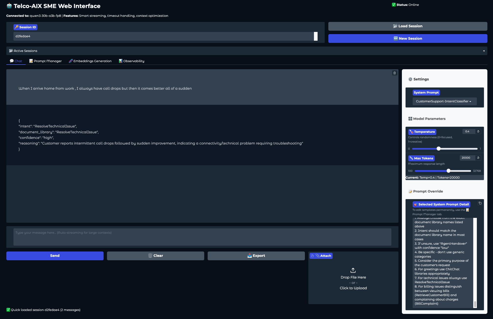
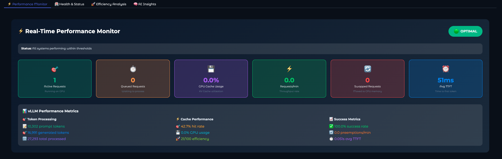
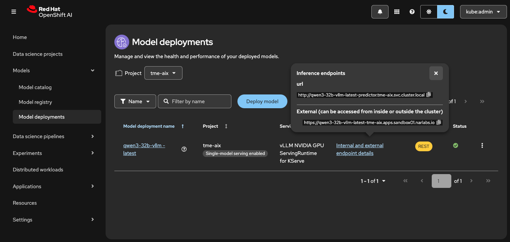

# Telco Subject Matter Expert (SME) Portal
**🎥 Demo Video**: [Watch on YouTube](https://youtu.be/UQB1T-ThQBk) <br>



## Overview
The Telco-AIX SME (Subject Matter Expert) Portal is a GenAI web application designed for telecom professionals to augment their daily operations. It provides AI-powered conversations with specialized knowledge in telco technologies, network architecture, and technical solutions powered with a well benchmarked models and in-purpose built expert prompts. We also offer glimse of embeddings generation and in-memory embeddings search.

The app-stack also features real-time metrics visualization and diagnostics from the vLLM runtime, session management, and multiple expert personas for domain-specific assistance. 

## Features

### 🤖 **AI-Powered Conversations**
- **Multiple Expert Personas**: 7+ specialized system prompts for different domains
- **Intelligent Responses**: Context-aware AI with telecommunications expertise
- **Smart Streaming**: Automatic streaming for contexts over 4000 tokens
- **File Upload Support**: Attach and analyze technical documents (txt, md, csv, json, py, pdf)

### 📂 **Persistent Sessions**
- **Session Management**: Create, load, and manage conversation sessions
- **Browser Refresh Resilience**: Never lose conversation progress
- **Session Sharing**: Share session IDs for collaboration
- **Auto-Save**: All conversations and settings automatically saved
- **24-Hour Retention**: Sessions persist for 24 hours with automatic cleanup

### ⚙️ **Advanced Configuration**
- **Temperature Control**: Adjust AI creativity (0=focused, 1=creative)
- **Token Limits**: Configure response length up to 20,000 tokens
- **System Prompts**: 7+ specialized expert personas plus custom options
- **Real-time Settings**: All parameters update dynamically
- **Context Management**: Auto-streaming for large contexts (>4000 tokens)

### 🎯 **Expert Domains**
1. **Default Assistant** - Precision-focused AI with executive-level clarity
2. **Network Expert** - 20+ years expertise in enterprise/SP networks, SD-WAN, SASE
3. **Telco Expert** - 5G/6G specialist with vendor ecosystem knowledge
4. **Cloud Expert** - Multi-cloud architect with FinOps and DevOps expertise
5. **Storage Expert** - Petabyte-scale storage infrastructure design
6. **CustomerSupport-IntentClassifier** - Telecom customer service intent classification
7. **Custom** - Create your own expert persona

## 📊 **Observability & Metrics**
The application includes comprehensive metrics collection and visualization:
- **Real-time Metrics**: Pull metrics from vLLM `/metrics` endpoint
- **Performance Monitoring**: Request counts, latency, token throughput
- **Resource Utilization**: GPU usage, cache hit rates, memory consumption
- **Interactive Dashboards**: Plotly-based visualizations with detailed insights



## Installation

### Prerequisites
- Python 3.8 or higher
- Required packages (see requirements-v2.txt)

### Setup
1. Clone or download the repository
2. Install dependencies:
   ```bash
   pip install -r requirements-v2.txt
   ```
3. Run the application:
   ```bash
   python sme-web-ui-v2.py
   ```
4. Access the web interface at: `http://localhost:30180`

### Authentication
- **Username**: `admin`
- **Password**: `minad`

## Usage

### Getting Started
1. **New Session**: Leave Session ID empty or click "🆕 New Session"
2. **Load Session**: Enter existing Session ID and click "📂 Load Session"
3. **Select Expert**: Choose appropriate system prompt from dropdown
4. **Configure Settings**: Adjust temperature and max tokens as needed
5. **Start Chatting**: Type your message and press Enter or click Send

### Session Management
- **Session IDs**: 8-character unique identifiers (e.g., "a1b2c3d4")
- **Persistence**: Sessions survive browser refreshes and server restarts
- **Recovery**: Enter session ID to continue previous conversations
- **Cleanup**: Expired sessions automatically removed after 24 hours

### File Uploads
- **Supported Formats**: .txt, .md, .csv, .json, .py, .pdf (with PyPDF2)
- **Size Limit**: 3,500 characters to prevent timeouts
- **One-time Use**: Files apply only to current message, not subsequent ones
- **PDF Support**: Optional - requires PyPDF2 installation

## System Prompts Configuration

### External File Loading
System prompts are loaded from `system_prompts.json`, making it easy to customize AI personas without code changes.

### File Structure
```json
{
    "Prompt Name": "Detailed prompt content with role, expertise, and methodology...",
    "Another Expert": "Another specialized prompt..."
}
```

### Management Features
- **Dynamic Reload**: Reload prompts without restarting
- **UI Editor**: Create and edit prompts directly in the web interface
- **Export/Import**: Manage prompts through JSON file editing
- **Validation**: Automatic syntax checking and error handling

### Adding Custom Prompts
1. Go to "📝 Prompt Manager" tab
2. Enter prompt name and detailed content
3. Click "💾 Save Prompt"
4. Prompt immediately available in dropdown

## Architecture

### Core Components
- **SessionManager**: File-based session persistence using pickle with 24-hour TTL
- **ChatClient**: Advanced HTTP client with streaming support and exponential backoff retries
- **ChatInterface**: Gradio-based UI with real-time updates and event handling
- **SystemPromptsManager**: Dynamic prompt loading and runtime editing
- **MetricsCollector**: Real-time metrics collection and visualization
- **EmbeddingClient**: Embeddings API integration for semantic search

### Technical Features
- **Smart Context Management**: Automatic streaming for contexts >4000 tokens
- **Retry Logic**: Robust error handling with configurable max attempts (default: 5)
- **Thread Safety**: Concurrent request handling with processing locks
- **Memory Optimization**: Context limits up to 20,000 tokens
- **Token Authentication**: Bearer token support for API security
- **Timeout Configuration**: Separate timeouts for streaming (10min) and non-streaming (4min)

### File Structure
```
├── sme-web-ui-v2.py        # Main application (enhanced version)
├── system_prompts.json     # Expert persona definitions (7+ personas)
├── sessions/               # Session storage directory (auto-created)
├── requirements-v2.txt     # Python dependencies
├── benchmarks/            # GenAI benchmark tests for vendors
├── models/                # Model-specific configurations
├── telcos-last-exam/      # Telco exam questions and comparisons
├── images/                # Screenshots and documentation images
└── README.md              # This documentation
```

## Configuration

### API Configuration
The application is configured to work with vLLM-served models. Update the `Config` class in `sme-web-ui-v2.py`:

```python
class Config:
    api_endpoint: str = "https://your-api-url"
    model_name: str = "your-model-name"
    api_token: str = "your-api-key"  # Optional
    use_token_auth: bool = True
```

### Model Deployment
Currently configured for OpenAI-compatible endpoints. The application has been tested with:
- **vLLM Runtime**: OpenAI-compatible serving
- **Hardware**: NVIDIA GPU acceleration recommended
- **Model Format**: Any model compatible with vLLM serving


### Customization
- Edit `Config` class in `sme-web-ui-v2.py` for API endpoints
- Modify `system_prompts.json` for expert personas
- Adjust timeout and retry settings in Config class
- Configure embeddings API separately if needed

## Troubleshooting

### Common Issues
- **Connection Problems**: Check API endpoint and network connectivity
- **Session Loading**: Verify session ID format (8 characters)
- **Prompt Errors**: Validate JSON syntax in system_prompts.json
- **Performance**: Reduce context size or max tokens for faster responses
- **PDF Processing**: Install PyPDF2 if PDF support is needed: `pip install PyPDF2`
- **Metrics Visualization**: Install Plotly for enhanced metrics: `pip install plotly`
- **Token Authentication**: Ensure API token is correctly configured in Config class

### Diagnostics
1. Go to "🔧 Diagnostics" tab
2. Click "🔍 Run Diagnostics" to test all connections
3. Check console output for detailed error information

### Session Management
- **List Sessions**: View all active sessions with details
- **Cleanup**: Remove expired sessions manually
- **Backup**: Session files stored in `sessions/` directory

## Development

### Key Files
- `sme-web-ui-v2.py`: Enhanced main application with all classes and UI
- `system_prompts.json`: Expert persona definitions (7+ specialized personas)
- `requirements-v2.txt`: Python package dependencies
- `CLAUDE.md`: Development guidance for Claude Code

### Key Classes
- **Config**: Application configuration and API settings
- **SessionManager**: Persistent session management with file-based storage
- **ChatClient**: HTTP client for API communication with streaming support
- **ChatInterface**: Gradio UI implementation
- **MetricsCollector**: Real-time metrics collection and processing
- **EmbeddingClient**: Embeddings API integration

### Features in Development
- Enhanced metrics visualization with Plotly
- Embeddings support for semantic search
- Advanced session management with collaboration features
- Real-time diagnostics and health monitoring
